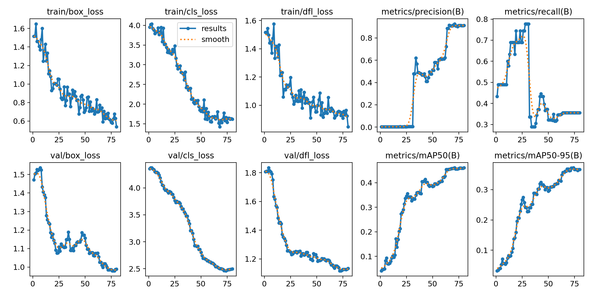
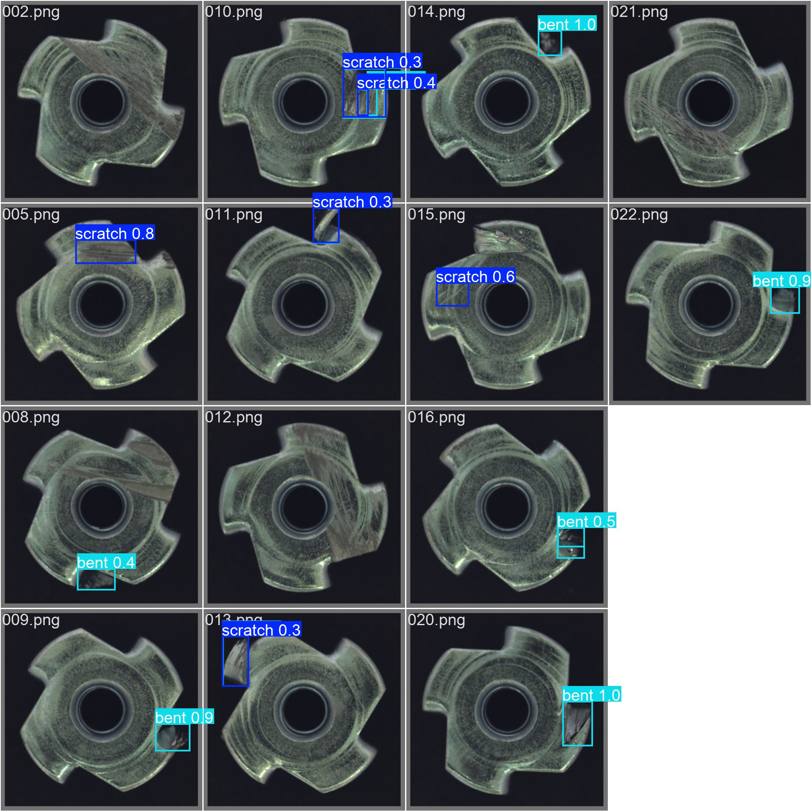

# Industrial Quality Control System

## Project Objective
The goal of this project is to develop a real-time industrial quality control system to detect `scratch` and `bent` defects in metal nuts. It utilizes **YOLOv8** for object detection, served via a **FastAPI** REST interface, with results persistently stored in a **PostgreSQL** database.

## Dataset
Derived from the MVTec *metal_nut* dataset. You can download the original dataset from the [MVTec AD Download Page](https://www.mvtec.com/company/research/datasets/mvtec-ad/downloads).

- **Preprocessing**: Converted binary masks to YOLO bounding box format.
- **Classes**: `scratch`, `bent`.
- **Split**: 80% Train, 20% Validation.

### Sample Data
| Scratch | Bent |
| :---: | :---: |
|  |  |


## Features
- **Data Pipeline**: 
  - `scripts/prepare_dataset.py`: Automated script to generate YOLO-formatted data.
  - `augment_data.py`: Used for data augmentation/enrichment.
- **Model Training**: 
  - `training/train_yolo.py`: Script to fine-tune YOLOv8n.
- **API**: 
  - `api/main.py`: FastAPI application providing a `/detect` endpoint.
- **Database**: 
  - `database/`: PostgreSQL integration for logging defect detections.
- **Utilities**:
  - `check_data_balance.py`: Checks class balance in training data.
  - `reproduce_issue.py`: Used to reproduce errors and verify the model.
  - `scripts/debug_model.py`: Performs detailed debugging on the model.

## Installation & Setup

1. **Install Dependencies**:
   ```bash
   pip install -r requirements.txt
   ```

2. **Verify/Prepare Dataset**:
   Run the necessary scripts to download or prepare the dataset.
   ```bash
   python scripts/prepare_dataset.py
   ```

3. **Check Data Balance**:
   Ensure classes are balanced before training.
   ```bash
   python check_data_balance.py
   ```
   *(Note: Severe imbalance (e.g., 5 scratch vs 31 bent) will cause poor detection performance.)*

## Training Results
The model performance and sample predictions can be seen below:

### Performance Metrics


### Sample Predictions


4. **Train Model**:
   ```bash
   python training/train_yolo.py
   ```
   *Note: Results are saved to `runs/detect/` and the best model is copied to `api/model/best.pt`.*

5. **Database Setup**:
   Ensure PostgreSQL is running. Configure `DATABASE_URL` env var or use default.
   The application auto-creates the table on startup.

6. **Run API**:
   ```bash
   uvicorn api.main:app --reload
   ```
   Server runs at `http://localhost:8000`.

## API Usage

**Endpoint**: `POST /detect`  
**Input**: Image file (multipart/form-data)  
**Response**: JSON containing detected defects and confidence scores.

Example using `curl`:
```bash
curl -X POST -F "file=@test_image.png" http://localhost:8000/detect
```

## Troubleshooting & Verification

- **Verify Model**: To test the model on validation images:
  ```bash
  python reproduce_issue.py
  ```

- **Debugging**: For more detailed model behavior analysis:
  ```bash
  python scripts/debug_model.py
  ```

## Folder Structure
- `api/`: FastAPI app and model files.
- `database/`: SQL scripts and connection logic.
- `scripts/`: Data preparation and debugging scripts.
- `training/`: YOLO configuration and training scripts.
- `data/`: Generated dataset (YOLO format). (*Ignored by Git*)
- `runs/`: Training results and weights. (*Ignored by Git*)
- `venv/`: Virtual environment files. (*Ignored by Git*)
